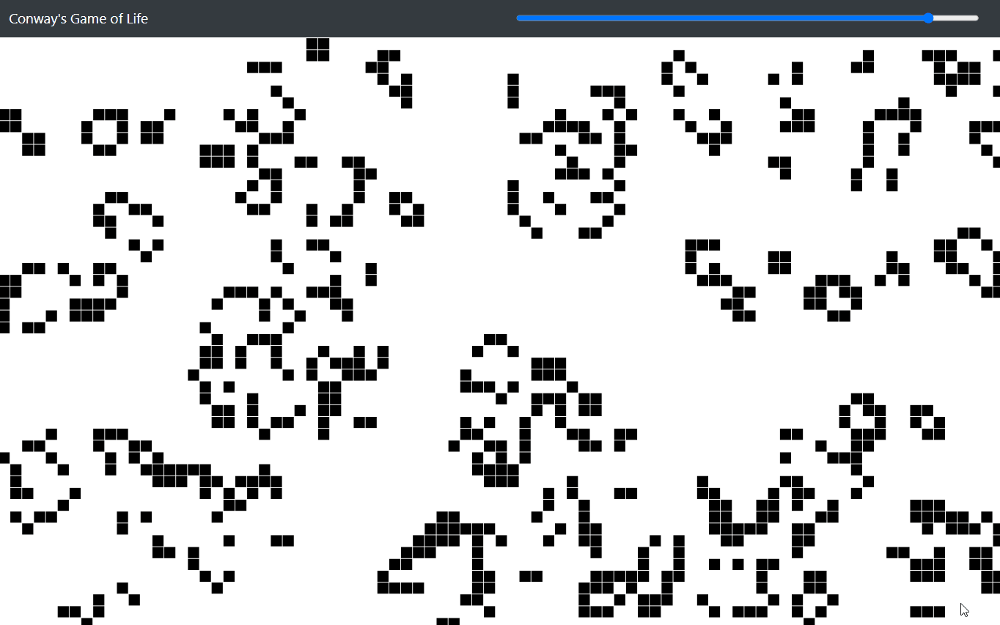

# Conway's Game of Life
This is an implementation of Conway's Game of Life (a cellular automaton). You can try this out here: https://joewadsworth.github.io/Conways-Game-Of-Life/

## Information
__Conway's Game of Life__ is a zero-player game, meaning that the evolution is based on the initial state provided. Cells can be in one of two states, live or dead. 

## Demo

*A Project by Joe Wadsworth*
